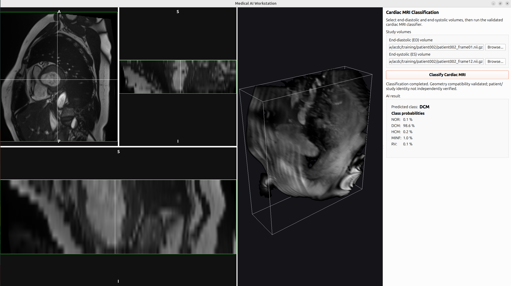
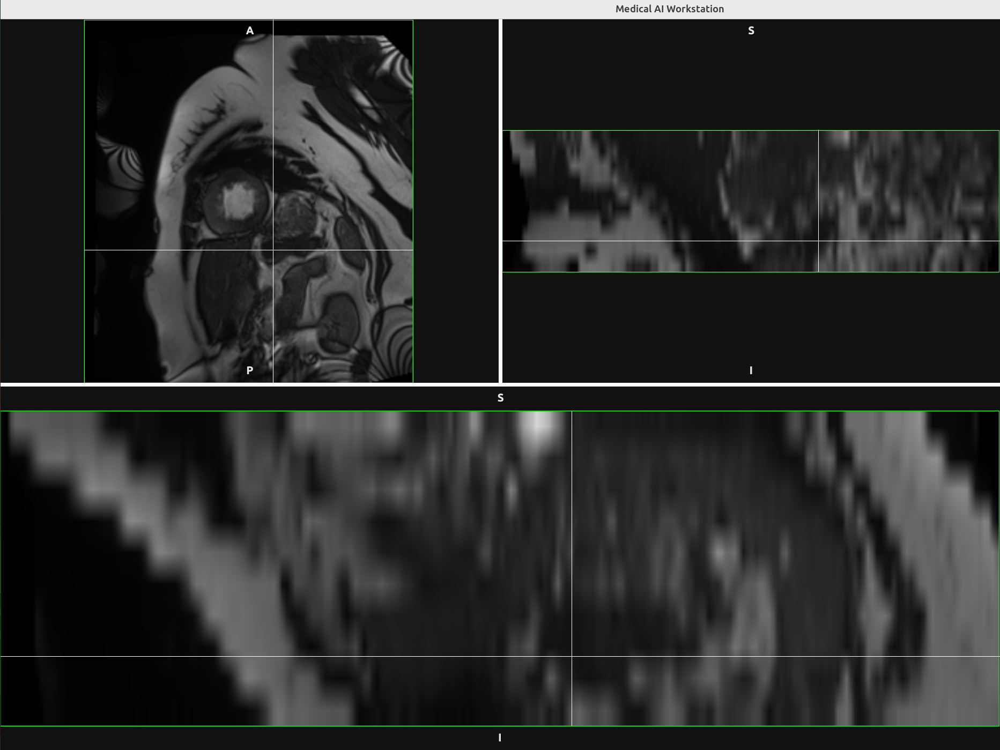
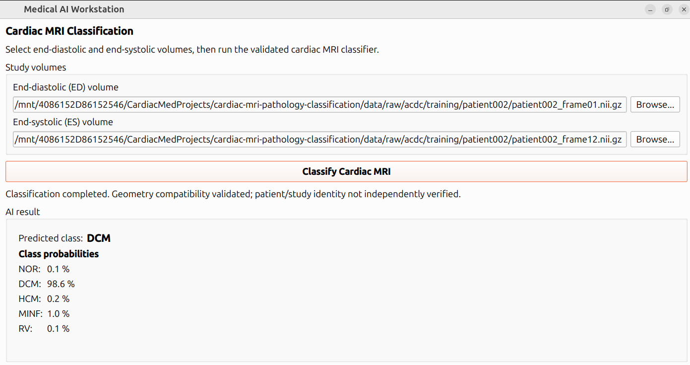

# Medical AI Workstation

Medical AI Workstation is a C++20 and Qt 6 desktop application that combines
medical-volume visualization with a validated cardiac MRI ED/ES classification
pipeline. The project emphasizes explicit ownership, responsive Qt workflows,
numerical Python/C++ parity, and clear boundaries between reusable imaging,
model-specific preprocessing, inference, and presentation.

The current v1 scope is an engineering workstation for reviewing one medical
volume and running the packaged cardiac MRI classifier on a selected
end-diastolic (ED) and end-systolic (ES) NIfTI pair. It is not a regulated or
clinically certified product.



## Key capabilities

- asynchronous medical-volume loading without blocking the Qt event loop;
- axial, sagittal, and coronal multiplanar reconstruction (MPR);
- synchronized voxel navigation and persistent crosshairs across MPR views;
- orientation-aware slice extraction and physical-coordinate mapping;
- GPU-backed OpenGL 3D volume rendering with transfer-function controls;
- one shared immutable volume presented by both MPR and 3D viewers;
- cardiac MRI ED/ES preprocessing and ONNX Runtime classification;
- an asynchronous Qt classification workflow around a synchronous headless
  service;
- runtime installation of the application, Qt dependencies, ONNX Runtime, and
  the configured cardiac deployment package;
- lifecycle-safe close behavior that rejects normal workstation close requests
  while viewer loading or classification is active.

### Multiplanar reconstruction



The viewer presents synchronized axial, sagittal, and coronal views with shared
crosshair navigation.

## Architecture at a glance

```text
src/app/main.cpp (composition root)
  |
  +-- MedicalAiWorkstationWindow
      |
      +-- ViewerWorkspaceWidget
      |   +-- VolumeLoadWorkflow -- QtConcurrent --> qt-viewer-pro IO
      |   +-- MprViewerWidget / SliceViewerWidget --> qtvp core + processing + render
      |   `-- VolumeRenderingWidget -------------> qtvp render
      |
      `-- CardiacMriClassificationWindow
          `-- CardiacMriClassificationWorkflow -- QtConcurrent
              `-- CardiacMriClassificationService
                  +-- CardiacMriPreprocessor --> qtvp volume core
                  `-- OnnxRuntimeSession ----> ONNX Runtime
```

The UI composes and presents these components; it does not contain cardiac
preprocessing or ONNX Runtime logic. See [Architecture](docs/architecture.md)
for responsibilities, dependency direction, ownership, and shutdown behavior.

## Cardiac classification pipeline

The cardiac workflow performs the following sequence:

1. validate request state, required paths, distinct filesystem identity, and
   the validated cardiac input format;
2. load ED and ES volumes asynchronously through qt-viewer-pro IO;
3. normalize trusted volume geometry to LPS and validate ED/ES geometry
   compatibility;
4. resample both volumes to one ED-derived physical grid;
5. apply the frozen center crop, joint intensity normalization, Z padding, and
   CDHW tensor layout;
6. run the packaged ONNX model through the generic runtime wrapper;
7. validate and present the predicted class and class probabilities.

The frozen model input is a float32 tensor with ED in channel 0 and ES in
channel 1. Detailed numerical assumptions remain in the production API
documentation and parity tests.

### Cardiac MRI classification



The screenshot shows a real ACDC ED/ES classification workflow and its result
presentation.

## Validated cardiac input contract

Cardiac AI classification accepts only:

- `.nii`
- `.nii.gz`

Extension matching is case-insensitive. Missing paths with a supported suffix
are passed to the loader so that normal IO errors remain authoritative.

This restriction applies to cardiac AI, not to the general viewer. The
qt-viewer-pro registry also supports viewer loading for DICOM (`.dcm`),
MetaImage (`.mhd`, `.mha`), NRRD (`.nrrd`, `.nhdr`), and RAW volumes described
by a JSON sidecar. Viewer-supported format does not mean cardiac-AI-validated
format.

## Prerequisites

A practical integrated build requires:

- a C++20 compiler;
- CMake 3.28 or newer for the current qt-viewer-pro source integration;
- Ninja or another CMake generator;
- Qt 6 with Core, Concurrent, Widgets, OpenGLWidgets, and Test components;
- ONNX Runtime C++ headers and library;
- nlohmann/json;
- OpenCV image-codec and image-processing components;
- ITK components required by qt-viewer-pro medical IO;
- an OpenGL-capable desktop environment for the rendered viewers;
- a local, read-only qt-viewer-pro source checkout;
- an external cardiac deployment package containing `classifier.onnx`,
  `deployment.json`, and `class_mapping.json`.

Qt 6.5 or newer is required for CMake's private Qt runtime deployment step.

## Configure and build

Use absolute paths for external dependencies and artifacts:

```bash
cmake -S . -B build -G Ninja \
  -DONNXRUNTIME_ROOT=/absolute/path/to/onnxruntime \
  -DMAIW_ENABLE_QTVIEWERPRO_INTEGRATION=ON \
  -DMAIW_QTVIEWERPRO_SOURCE_DIR=/absolute/path/to/qt-viewer-pro \
  -DMAIW_CARDIAC_MRI_PACKAGE_DIR=/absolute/path/to/cardiac_mri_pathology

cmake --build build
```

The deployment package is validated during configuration when its path is
provided. Real-data and full parity tests are enabled only when their external
inputs are also configured:

- `MAIW_CARDIAC_MRI_ACDC_TRAINING_DIR`
- `MAIW_CARDIAC_MRI_REAL_ED_PATH`
- `MAIW_CARDIAC_MRI_REAL_ES_PATH`

## Test

```bash
ctest --test-dir build --output-on-failure
```

The test suite covers portable classification contracts, preprocessing
mathematics, Qt workflows, viewer behavior, lifecycle safety, real-volume smoke
tests, and numerical golden parity. Tests that require the deployment package,
real ACDC data, or golden artifacts are conditionally registered. Upstream
qt-viewer-pro tests remain visible but intentionally disabled in the integrated
parent-project CTest configuration.

Validation uses real ACDC-derived references for medical AI release gates;
synthetic arrays are limited to utility and mathematical tests. See
[Phase 9 real-study validation](docs/validation/phase9_real_study_validation.md)
for the recorded independent parity and manual GUI evidence.

## Install and run

```bash
cmake --install build --prefix "$PWD/install"
./install/bin/medical-ai-workstation
```

The install step places the executable in `bin`, ONNX Runtime in the install
library directory, and—when configured—the cardiac package under
`share/medical-ai-workstation/cardiac_mri_pathology`. The application resolves
that install-relative package by default.

For a development build or an alternate deployment package, use:

```bash
./build/medical-ai-workstation \
  --cardiac-package /absolute/path/to/cardiac_mri_pathology
```

In the application, select ED and ES volumes using the cardiac input controls.
A committed path is also loaded into the viewer workspace. Select **Classify
Cardiac MRI** to start the asynchronous classification workflow. Only one load
and one classification operation of their respective kinds may run at a time.

## Validation summary

The repository contains automated gates for:

- Python/C++ preprocessing parity on external ACDC-derived golden references;
- end-to-end and classification-service parity;
- ONNX logits and probability parity;
- real-volume loading, MPR navigation, physical-coordinate behavior, and 3D
  assignment;
- asynchronous success, failure, recovery, shutdown, and workstation close
  behavior;
- cardiac path identity and NIfTI format boundaries.

Engineering parity establishes agreement with the validated reference pipeline
for the tested inputs. It does not establish clinical effectiveness or model
generalization.

## Project boundaries and status

- qt-viewer-pro is an external, read-only source dependency and is not owned by
  this repository.
- The model, ACDC dataset, deployment package, and golden artifacts remain
  external and are not committed here.
- Generic ONNX Runtime code is model- and modality-independent.
- Cardiac preprocessing remains isolated from generic viewer and runtime code.
- The application has no regulatory approval, clinical certification, or claim
  of production clinical deployment.

The current scope is an engineering-validated workstation undergoing final
release validation. Known evidence boundaries and deferred post-v1 work are
listed in [Known limitations](docs/known_limitations.md).

Further documentation:

- [Architecture](docs/architecture.md)
- [Known limitations](docs/known_limitations.md)
- [Phase 9 real-study validation](docs/validation/phase9_real_study_validation.md)
